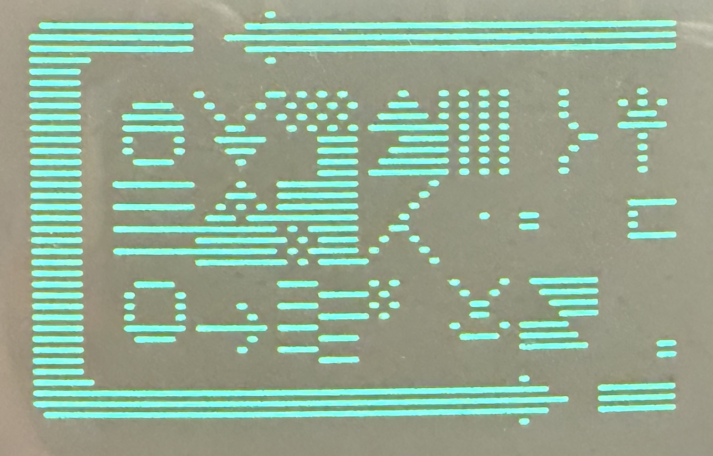
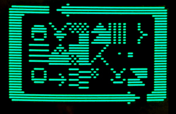

# HIRES4032 — technical notes

## Overview

> **Provenance:** HIRES4032 is an adaptation of the March 1980 CURSOR #18 `HI-RES` program. The current PRGs retain and modify historical BASIC code and retain the original copyright notices. The 4032 timing/synchronization work is new, but no GPL or other blanket license is asserted for the combined programs in their present form.

Two variants of HIRES4032 are supplied:

1. H4032ART - literal crop of the historical artwork



2. H4032FIT - fitted artwork retaining both left and right borders



To run one from disk, for example:

```basic
LOAD"H4032ART",8
RUN
```

Press RETURN at the title screen to enter the interactive graphics display.


The March 1980 CURSOR #18 program **HI-RES**, produces graphics on an
early Commodore PET by changing screen character codes while the CRT raster is
being drawn. It does not install a programmable character set and it does not
provide a conventional bitmap. Instead, it uses precisely timed writes to make
successive raster rows of an apparent character cell come from different PET
character-ROM entries.

The original program depends on the fixed video timing of an early PET 2001 and
does not run correctly on a CRTC-based PET 4032. HIRES4032 is a software-only
adaptation for the 40-column CRTC PET. It replaces the original 64-cycle scanline
kernel with a 50-cycle kernel, synchronizes using the CRTC vertical-retrace status,
and reduces the active width from nine to eight character bands. The resulting
window is nominally **64 by 40 dot positions**.

---

## 1. Historical program and the unusual meaning of “high resolution”

The original PRG is a BASIC program loaded at `$0401` with an embedded 6502
machine-code payload beginning at `$0EF4` (decimal 3828). The BASIC front end
finds the machine-code raster blocks and records the addresses of immediate
operands within them. The graphics data therefore live inside executable code:
editing the picture means POKEing new values into operands such as `LDX #value`,
`LDY #value` and `LDA #value`.

The crucial idea is to change screen RAM after a displayed cell has been fetched
for one raster line but before it is fetched for the next. If a cell contains
character A on raster 0, character B on raster 1, character C on raster 2, and so
on, the viewer sees one apparent 8x8 cell whose eight rows were taken from eight
potentially different ROM characters. Such a composite need not exist anywhere
in the PET character set.

This is why “individual pixels” can appear even though the PET still obtains its
actual dot patterns from character ROM. The mechanism is best described as
**raster-row character substitution** or **beam racing** rather than a true bitmap
framebuffer.

### 1.1 Fundamental constraint

For each 8-dot-wide group on a particular raster, the pattern must still be a
raster row available from some character-ROM code, including its reverse-video
form. The trick breaks the normal rule that all eight raster rows must belong to
the same character; it does not make all 256 possible 8-bit patterns available
on every raster row.

---

## 2. Why the PET 2001 program fails on the CRTC 4032

The original machine-code kernel is tied to the early PET's scanline cadence. A
CRTC PET 4032 uses a different video architecture and different line timing.
Merely changing the IRQ vector address is therefore insufficient.

The 40-column 60 Hz Editor ROM disassembly identifies `$E01B` as the jump-table
entry that initializes the CRTC to graphics mode. Its graphics timing table at
`$E7C3` begins with `$31` for CRTC R0 and contains `$07` for R9.

For a 6545-family CRTC:

- R0 is horizontal total minus one, so `$31` means 49 + 1 = **50 character
  clocks per scanline**.
- R9 is maximum raster address, so `$07` means raster addresses 0 through 7,
  or **8 raster lines per character row**.

Thus the natural CRTC 4032 timing target is 50 CPU cycles per raster line rather
than the original program's approximately 64-cycle line.

If the old 64-cycle kernel were run unchanged against a 50-cycle display line, it
would be 14 cycles late after the first line, 28 after the second, and 140 cycles
(2.8 complete 4032 raster lines) late after ten. The image cannot remain locked
to the beam.

---

## 3. The 4032 solution

### 3.1 Width: eight bands instead of nine

A normal independent update consists of an immediate load and an absolute store:

```asm
LDA #value       ; 2 cycles
STA screen       ; 4 cycles
```

That is six cycles per value. Nine independent values require at least 54
cycles, already longer than a 50-cycle 4032 scanline. Eight values need 48
cycles, leaving exactly two cycles for a NOP:

```text
8 x 6 = 48 cycles
NOP   =  2 cycles
       --
       50 cycles
```

Therefore the reliable natural width is eight character bands:

```text
8 bands x 8 dots = 64 dot positions
```

Five 8-raster character rows give:

```text
5 x 8 = 40 raster lines
```

so the display region is **64 x 40**.

### 3.2 Actual regular raster kernel

The implementation uses X, Y and A to move the first three values into screen RAM
compactly, then uses A for the remaining five. A regular raster is:

```asm
LDX #value0       ; 2
LDY #value1       ; 2
LDA #value2       ; 2
STX screen+0      ; 4   write complete at cycle 10
STY screen+1      ; 4   write complete at cycle 14
STA screen+2      ; 4   write complete at cycle 18
LDA #value3       ; 2
STA screen+3      ; 4   write complete at cycle 24
LDA #value4       ; 2
STA screen+4      ; 4   write complete at cycle 30
LDA #value5       ; 2
STA screen+5      ; 4   write complete at cycle 36
LDA #value6       ; 2
STA screen+6      ; 4   write complete at cycle 42
LDA #value7       ; 2
STA screen+7      ; 4   write complete at cycle 48
NOP               ; 2
                  ; ----
                  ; 50 cycles
```

Every regular block therefore begins at the same horizontal beam phase on the
next scanline. The instruction-level validator confirms exactly 50 cycles from
`line_01` through `line_39`.

### 3.3 Screen placement

HIRES4032 targets text columns 16 through 23 in the first five text
rows. Screen RAM begins at `$8000`; the five ordinary row bases are separated by
40 bytes. Only these eight cells in each row are used for the raster race.

The program clears the first five text rows before installing the renderer.
This removes unrelated title-screen remnants without changing any timing-critical
instruction in the IRQ kernel.

---

## 4. Synchronization to the CRTC

The 6545-1 provides an 8-bit status register. Its bit 5 indicates vertical
retrace/blanking; the datasheet specifically describes using this status to time
video-memory access during vertical blanking.

HIRES4032 reads the CRTC status at `$E880` and uses the transition around vertical
blank to establish a repeatable frame reference. Raster 0 is prepared, the code
waits for blanking transitions, and then a small fine-phase delay aligns the
50-cycle kernel with the useful screen-memory fetch window.

The program's working phase count is:

```text
2
```

Its immediate operand is at:

```text
$0F7A = decimal 3962
```

Testing on a real PET 4032 produced stable graphics at this default, so that
value was frozen for this release. A count of zero must not be used because the
decrement/branch delay loop would wrap and execute 256 iterations.

The Commodore PET 4032 Editor ROM (901499-01) uses the CRTC at $E880,
and the hardware interrupt vector (CINV) is located at $0090/$0091.

---

## 5. Setup, IRQ installation and restoration

The key addresses for HIRES4032 are:

| Symbol | Address | Decimal | Purpose |
|---|---:|---:|---|
| `setup_old_rom` | `$0EF4` | 3828 | retained compatibility entry |
| `setup_4032` | `$0F0F` | 3855 | CRTC 4032 setup/restore entry |
| `clear_top_rows` | `$0F17` | 3863 | clear five rows before enabling graphics |
| `video_irq` | `$0F39` | 3897 | custom frame handler |
| `line_00` | `$0F44` | 3908 | first raster block |
| `phase_count_operand` | `$0F7A` | 3962 | fine timing count |
| `line_01` | `$0F7E` | 3966 | first regular 50-cycle block |
| `line_39` | `$1594` | 5524 | final raster block |
| `video_irq_epilogue` | `$15BD` | 5565 | restore registers/state |
| `chain_irq` | `$15C3` | 5571 | continue normal Editor IRQ |

The CRTC setup path calls the Editor jump-table entry `$E01B`, documented as
“Initialize CRTC to GRAPHICS mode.” The custom IRQ vector is installed through
`CINV` at `$0090/$0091`. The same setup entry is used as a toggle so that `Q`
restores normal interrupt handling before ending the BASIC program.

The custom handler ultimately chains to the Editor's normal IRQ service rather
than permanently suppressing clock/keyboard processing.

---

## 6. The BASIC self-modifying editor

The BASIC program deliberately scans the machine-code body to find each raster
block's first `LDX #immediate` opcode (`$A2`). It stores the address of the first
operand in `RW(row)`. The eight editable immediate operands within each regular
block are reached using the offsets:

```text
0, 2, 4, 15, 20, 25, 30, 35
```

The 4032 conversion changed every visible-width-dependent loop from nine columns
to eight; this was necessary not only in the machine code but also in horizontal
wrapping, fill loops and the `S` operation.

### 6.1 Coordinate format

The original program's concise decimal coordinate convention is retained:

```text
POSITION = 10 * raster + column
```

with raster 0..39 and column 0..7.  Examples:

```text
0    -> raster 0,  column 0
80   -> raster 8,  column 0
167  -> raster 16, column 7
397  -> raster 39, column 7
```

### 6.2 Commands

`H POSITION [+STEP] LENGTH CHAR` writes horizontally through byte-columns and can
wrap into the next raster. `V` writes vertically and can wrap into the next
byte-column. `P` changes one raster/column operand. `F` changes all 320 operands.
`S` clears an eight-raster-by-eight-band region and lays the supplied character
along a diagonal.

`S` retains the historical program's original semantics: its POSITION column
digit is effectively ignored. This release intentionally leaves this behavior
alone because the hardware-tested code is being frozen rather than cosmetically
rewritten after validation.

---

## 7. Why the historical artwork was cut off

The original PET 2001 picture is nine character bands wide:

```text
9 x 8 = 72 dots
```

The 4032 kernel has room for only eight:

```text
8 x 8 = 64 dots
```

`H4032ART` is deliberately literal: it keeps source columns 0 through 7 and drops
source column 8. Inspection of the original operand data shows that source column
8 contains much of the right border, explaining the visibly chopped right-hand
edge in the hardware photograph.

This is not a timing artifact and not stale screen memory; it is the expected
72-to-64-dot crop.

---

## 8. H4032FIT: a 4032-adapted version of the artwork

A true arbitrary horizontal scale is awkward because each eight-dot raster group
must still correspond to a legal character-ROM row. The fitted version therefore
reflows the image at the natural 8-pixel-band granularity.

The original nine source bands are mapped as follows:

```text
4032 destination:  0  1  2  3  4  5  6  7
original source:   0  1  2  3  4  5  6  8
```

Original source band 7 is omitted and the original right-border band 8 moves left
into destination band 7. Band 7 was selected because it is the sparsest of the
interior source bands in the supplied artwork, measured by non-space/non-reverse-
space operand activity. This keeps both outer borders and loses the least active
interior band.

The fitted operand values are present directly in `H4032FIT.asm` and `H4032FIT.PRG`.

---

## 9. Detailed command reference

### 9.1 Coordinate system

HIRES4032 preserves the compact decimal POSITION format of the original CURSOR
program:

```text
POSITION = 10 * R + C
```

- `R` = raster number, 0 through 39.
- `C` = 8-dot byte-column, 0 through 7.

Examples:

| POSITION | Raster | Column | Meaning |
|---:|---:|---:|---|
| 0 | 0 | 0 | upper-left group |
| 7 | 0 | 7 | upper-right group |
| 80 | 8 | 0 | first column of raster 8 |
| 167 | 16 | 7 | last column of raster 16 |
| 397 | 39 | 7 | lower-right group |

Each editable entry is one character code used for **one raster row** of an
8-dot-wide character cell. It therefore changes an 8-dot pattern on one
scanline, not an entire ordinary PET character cell.

### 9.2 H — horizontal

```text
H POSITION [+STEP] LENGTH CHAR
```

Starting at POSITION, write CHAR horizontally for LENGTH entries. STEP defaults
to 1. Reaching column 8 wraps to column 0 of the next raster.

Examples:

```text
H 80 8 A
H 80 +2 4 A
```

The second example modifies columns 0, 2, 4 and 6 of raster 8.

### 9.3 V — vertical

```text
V POSITION [+STEP] LENGTH CHAR
```

Starting at POSITION, write CHAR down successive rasters. STEP defaults to 1.
Passing raster 39 wraps to raster 0 of the next byte-column.

Examples:

```text
V 0 40 B
V 7 +2 20 B
```

### 9.4 S — diagonal/shape command

```text
S POSITION CHAR
```

This retains the original CURSOR #18 program's unusual semantics. The raster
component of POSITION selects the first of eight rasters. For each raster the
routine clears the eight columns and places CHAR at columns 0, 1, ... 7 in turn.
The POSITION column digit is effectively ignored.

For example:

```text
S 160 C
```

uses rasters 16 through 23 and makes a one-byte-column-per-raster diagonal.

### 9.5 F — fill

```text
F CHAR
```

Writes CHAR to all 40 x 8 = 320 editable raster/column entries.

Example:

```text
F A
```

This produces five rows of apparent `A`
patterns in the graphics window.

### 9.6 P — point entry

```text
P POSITION CHAR
```

Changes one raster/column entry. Because the entry is one character-ROM raster
pattern, this is an 8-dot-wide one-scanline change rather than a single physical
pixel.

Example:

```text
P 397 D
```

changes the lower-right entry.

### 9.7 Q — quit

```text
Q
```

Calls the setup/restore entry again, returns normal interrupt handling, clears the
screen and ends the BASIC program.

### 9.8 Character entry and reverse video

`CHAR` is translated into the PET screen code used as the immediate operand in
the raster kernel. A reverse-video character may be entered using `RVS ON`; the
program preserves the original CURSOR convention for selecting the inverse form.

---

## 10. Files in this directory

| File | Description |
|---|---|
| `pet4032/H4032ART.PRG` | Full program (BASIC and machine-code) displaying the original art work, in .PRG format |
| `pet4032/H4032ART.pdf` | Listing of the BASIC portion in Adobe Acrobat format |
| `pet4032/H4032ART.asm` | Annotated disassembly of the machine-code renderer in text format |
| `pet4032/H4032ART.jpg` | Photo of the original artwork rendered on PET 4032, showing truncation on right side |
| `pet4032/H4032FIT.PRG` | Full program (BASIC and machine-code) displaying modified art work, in .PRG format |
| `pet4032/H4032FIT.pdf` | Listing of the BASIC portion in Adobe Acrobat format |
| `pet4032/H4032FIT.asm` | Annotated disassembly of the machine-code renderer in text format |
| `pet4032/H4032FIT.jpg` | Photo of the modified artwork rendered on PET 4032, showing it fits in available display region |
| `pet4032/README.md` | Explains the adaptation to PET 4032 |
